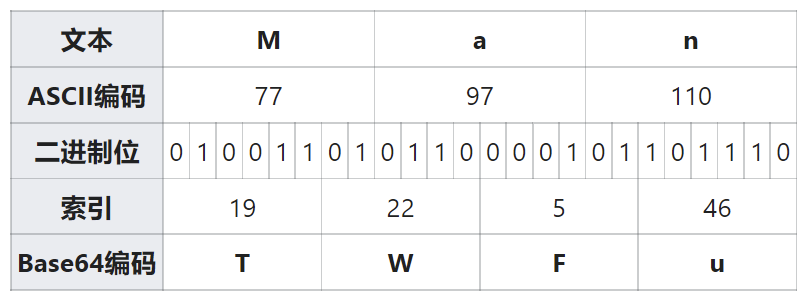
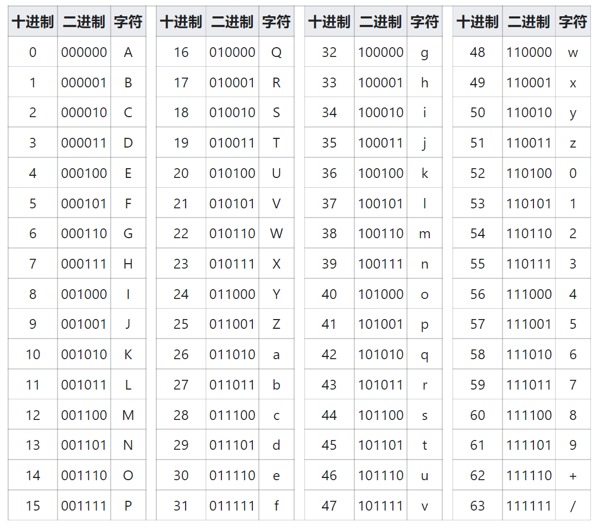
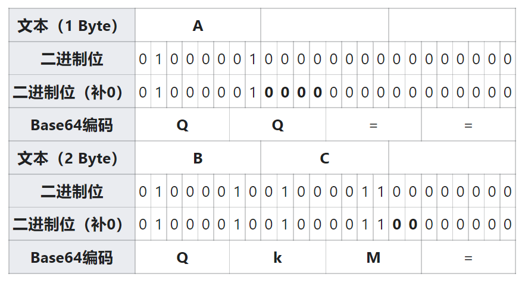

# Base64

Base64 是一种基于 64 个可打印字符来表示二进制数据的表示方法。由于 $64=2^6$，所以每 6 个位元为一个 Base64 单元，对应某个可打印字符。3 个字节为 24 个位元，对应于 4 个 Base64 单元，即 3 个字节可由 4 个可打印字符来表示。在 Base64 中的可打印字符包括字母 A-Z、a-z、数字 0-9，这样共有 62 个字符，另外的 2 个可打印符号在不同的系统中不同。

Base64 常用于在通常处理文本数据的场合表示、传输、存储一些二进制数据，包括 MIME 的电子邮件以及 XML 的一些复杂数据。

## 示例

举例来说，一段引用自托马斯·霍布斯《利维坦》的文句：

```
Man is distinguished, not only by his reason, but by this singular passion 
from other animals, which is a lust of the mind, that by a perseverance of 
delight in the continued and indefatigable generation of knowledge, exceeds 
the short vehemence of any carnal pleasure.
```

经过 Base64 编码之后变成：

```
TWFuIGlzIGRpc3Rpbmd1aXNoZWQsIG5vdCBvbmx5IGJ5IGhpcyByZWFzb24sIGJ1dCBieSB0aGlz
IHNpbmd1bGFyIHBhc3Npb24gZnJvbSBvdGhlciBhbmltYWxzLCB3aGljaCBpcyBhIGx1c3Qgb2Yg
dGhlIG1pbmQsIHRoYXQgYnkgYSBwZXJzZXZlcmFuY2Ugb2YgZGVsaWdodCBpbiB0aGUgY29udGlu
dWVkIGFuZCBpbmRlZmF0aWdhYmxlIGdlbmVyYXRpb24gb2Yga25vd2xlZGdlLCBleGNlZWRzIHRo
ZSBzaG9ydCB2ZWhlbWVuY2Ugb2YgYW55IGNhcm5hbCBwbGVhc3VyZS4=
```

编码“Man”的结果为 `TWFu`，编码过程如下：

<figure>

</figure>

## 索引表

<figure>

</figure>

如果要编码的字节数不能被 3 整除，最后会剩余 1 个或 2 个字节，那么可以使用下面的方法进行处理：先使用 0 字节值在末尾补足，使字节数能够被 3 整除，然后再进行 Base64 编码。在编码后的 Base64 文本末尾加上 1 个或 2 个 `=`，代表补足的字节数。也就是说，如果最后剩余 1 个字节，那么需要补足 2 个字节，最后一个 Base64 单元的末四位是 0，末尾附加 2 个等号；如果最后剩余 2 个字节，那么需要补足 1 个字节，最后一个 Base64 单元的末两位是 0，末尾附加 1 个等号。参考下表：

<figure>

</figure>

## 常用编解码工具

### Linux 命令：base64

`base64` 命令对文件或标准输入进行 Base64 编码或解码，并打印到标准输出。

```shell
$ echo -n "data to be encoded" | base64
ZGF0YSB0byBiZSBlbmNvZGVk
$ echo -n "ZGF0YSB0byBiZSBlbmNvZGVk" | base64 -d
data to be encoded
```

### Python 标准库：base64

参见 [base64——Base16, Base32, Base64, Base85 数据编码](../../python/standard-library/base64.md)。

### 网页工具

搜索“base64 编解码”关键词即可获取大量在线 Base64 编解码的网页工具。
